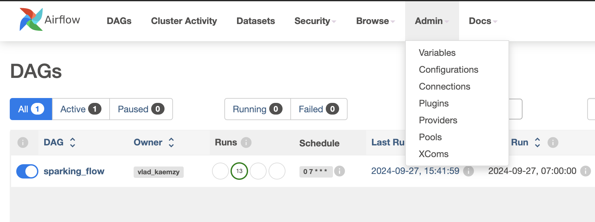
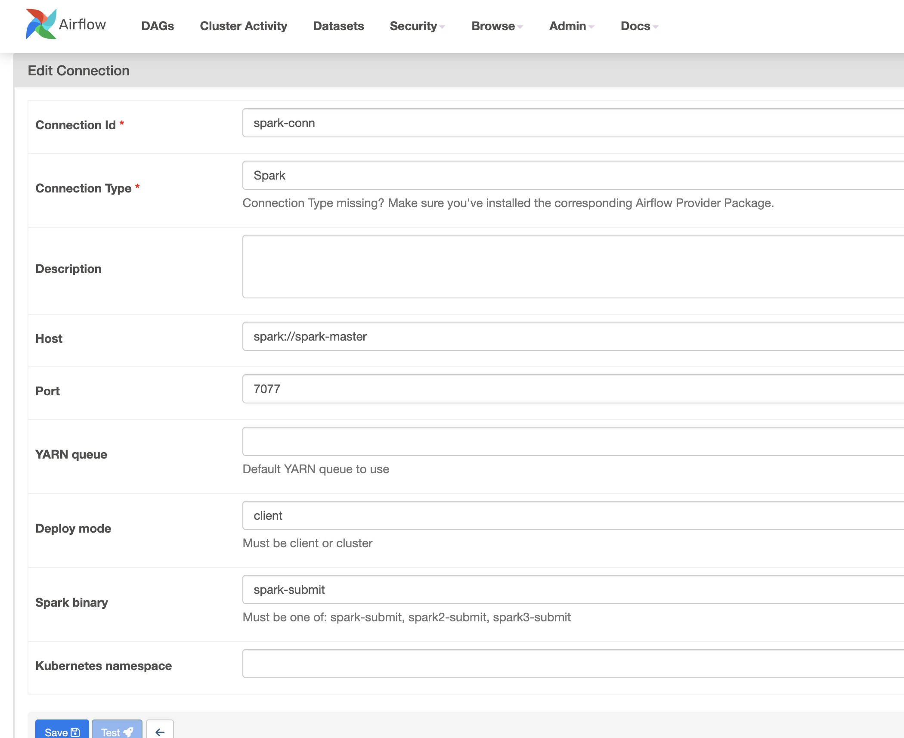
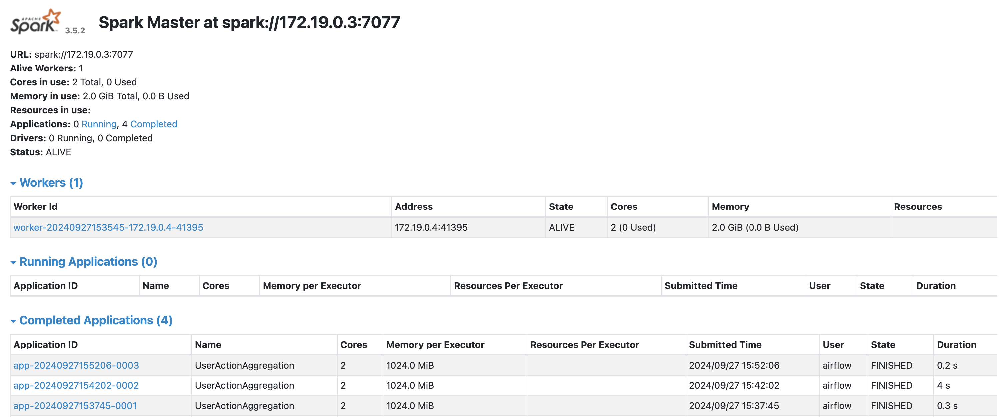

      

   
   
   
   
   

## Project Description

_This project is designed to process a stream of data logs that record CRUD (Create, Read, Update, Delete) actions performed by users. The data is aggregated within a specified time window (7 days) to generate summary reports of the number of each type of action performed by each user._

_The project runs on **Apache Airflow** and **Apache Spark** within **Docker containers**. Each day, the system processes user logs stored in CSV format and calculates the sum of each action type (create, read, update, delete) performed over the last 7 days. The results are written into CSV files, with one row per user, showing the counts for each action type._

## Input Data

_The input consists of daily CSV files with the following columns:_

  - ***email***: User’s email address.
  - ***action***: The type of action performed (_CREATE, READ, UPDATE, DELETE_).
  - ***dt***: Date of the action (_in YYYY-MM-DD format_).
    
_Each CSV file contains logs for a specific day, and filenames follow the format_ **YYYY-MM-DD.csv**.

## Output Data

The output is a CSV file that contains the aggregated results for each user over the previous 7 days. The output schema includes:

  - ***email***: User's email address.
  - ***create_count***: The count of CREATE actions.
  - ***read_count***: The count of READ actions.
  - ***update_count***: The count of UPDATE actions.
  - ***delete_count***: The count of DELETE actions.
    
_Output files are named according to the date the aggregation is generated for, using the format ***YYYY-MM-DD.csv***, and are stored in the **output/ directory**._

## Setup

### Clone project

`$ git clone https://github.com/DFSF-F/airspark`

### Build airflow Docker

Inside the airspark/

`$ docker-compose up -d --build`

you can see in the airflow webserver log files that you need to run the `airflow db init` command. Consequently, we need to run the `docker-compose up -d` command again without `--build`.

Now you need to create folders for input and output files (to avoid changing the docker-compose file I suggest creating a **repos_csv** folder and within it create two folders _input, output_). After that you should run the input generation script **generate.py**, the way to use the script is specified at the beginning of the script.

## How to run a DAG to test

1. Configure spark connection acessing airflow web UI http://localhost:8080 and going to Connections

 

2. Edit the spark_default connection inserting spark://spark-master in Host field and Port 7077

 

 

3. Run the spark-test DAG

4. Check the output folder, there you will see Dag results with a .csv extension

 

 

5. Check the spark application in the Spark Master web UI (http://localhost:9090)

 

 
